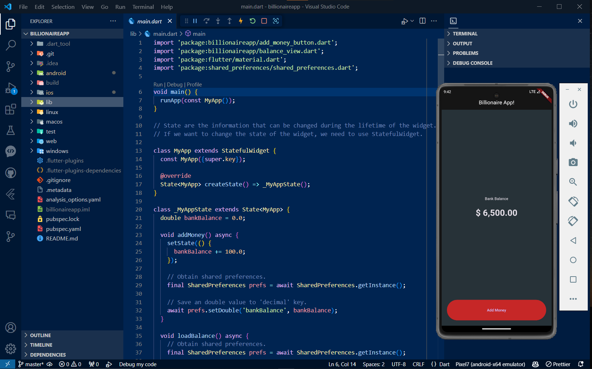

# billionaireapp

A new Flutter using StatelessWidget and StatefulWidget, learn basic about child component and parent component communication using props.

## Getting Started

This project is a starting point for a Flutter application.

A few resources to get you started if this is your first Flutter project:

- [Lab: Write your first Flutter app](https://docs.flutter.dev/get-started/codelab)
- [Cookbook: Useful Flutter samples](https://docs.flutter.dev/cookbook)

For help getting started with Flutter development, view the
[online documentation](https://docs.flutter.dev/), which offers tutorials,
samples, guidance on mobile development, and a full API reference.

## Project Description

This Flutter project is a billionaire app that allows users to track their bank balance and add money to their account. The app utilizes various technologies and packages to provide a modern and user-friendly experience.

### Technologies Used

- Flutter: A cross-platform framework for building mobile applications.
- Dart: The programming language used for developing Flutter apps.

### Features

- Formatting Bank Balance: The app uses the `intl` package to format the bank balance with commas for better readability.
- Styling Bank Balance: The auto-generated $ sign is removed and the bank balance is styled using the `TextStyle` class with a font size of 32 and bold font weight.
- Shared Preferences: The app utilizes the `shared_preferences` package to save the bank balance in the local storage. The `SharedPreferences` class is used to store and retrieve the bank balance using the 'bankBalance' key.
- State Management: The app uses the `StatefulWidget` class to manage the state of the bank balance. The UI components are updated in real-time when the user clicks the "Add Money" button.

### Commit Details

- Commit 18818db9e4e08162c50946b7b39c034ade84f7c0: Installs the `intl` package for formatting the bank balance and updates the styling of the balance using `TextStyle`.
- Commit 6ced13ec4add583c6b770dc2c064b78f08fd86c1: Passes a function from the parent component `main.dart` to the child component `add_money_button.dart`.
- Commit f19cb68ce16d63d0bea42b83f1810f35d347a4e1: Adds the `shared_preferences` package for saving the bank balance in the local storage. Implements the `addMoney` function as an asynchronous function and adds the `loadBalance` function to retrieve the bank balance from shared preferences.
- Commit fcbfd35ac923978796f5d0b55b1d4010b4df43c4: Updates the app to use `StatefulWidget` for dynamically changing variables. Implements the `bankBalance` variable and triggers UI updates using `setState`.
- Commit 3d39ab26d7efe86b0bccf8307ba2f0b4ce0557ed: Creates the basic home layout of the billionaire app using the `ElevatedButton` element.

### Android View 

